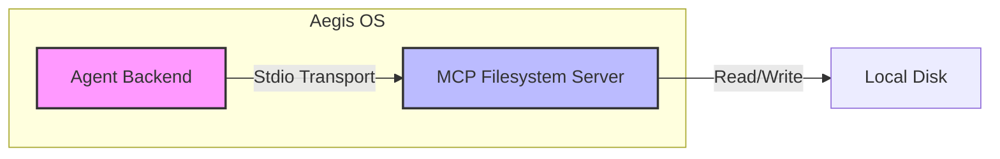

# Phase 5: Model Context Protocol (MCP)

> "The USB-C port for AI applications."

## 📚 What is MCP?

The **Model Context Protocol (MCP)** is an open standard that enables AI models to connect to external data and tools. Instead of building custom integrations for every data source (Google Drive, Slack, PostgreSQL, Local Filesystem), you build **one** MCP server, and any MCP-compliant client (like Claude Desktop, Zed, or your Aegis Agent) can use it.

### Core Concepts

1.  **MCP Server**: A standalone application that exposes Resources (data), Prompts, and Tools.
2.  **MCP Client**: The application (your agent) that connects to the server and uses its capabilities.
3.  **Transport**: How they talk. Common transports are `stdio` (standard input/output for local processes) and `SSE` (Server-Sent Events for remote connections).

---

## 🏗️ Architecture in Aegis OS

In Phase 5, we integrated MCP into Aegis OS to give our agents filesystem access without hardcoding logic directly into the agent backend.



### Components

1.  **`apps/mcp-filesystem`**:
    *   A Node.js application built with `@modelcontextprotocol/sdk`.
    *   Exposes tools: `read_file`, `write_file`, `list_directory`.
    *   Runs as a sub-process of the agent backend.

2.  **`apps/agent-backend`**:
    *   **`McpClientService`** (`src/lib/mcp/McpClient.ts`): Manages the connection to the MCP server.
    *   **`Tool Registry`** (`src/tools/registry.ts`): Dynamically registers tools discovered from the MCP server.
    *   **Integration**: On startup, the agent backend spins up the MCP server and adds its tools to the global tool registry.

---

## 👨‍💻 Implementation Details

### 1. Creating the MCP Server

We used the `@modelcontextprotocol/sdk` to create a server using the `Server` class.

```typescript
// apps/mcp-filesystem/src/index.ts
const server = new Server(
  { name: "mcp-filesystem", version: "0.1.0" },
  { capabilities: { tools: {} } }
);

server.setRequestHandler(CallToolRequestSchema, async (request) => {
  // Handle tool calls like read_file, write_file
});
```

### 2. Creating the Client

The client connects via `StdioClientTransport`. This means the Agent spawns the MCP server as a child process and talks to it over stdin/stdout.

```typescript
// apps/agent-backend/src/lib/mcp/McpClient.ts
this.transport = new StdioClientTransport({
  command: "node",
  args: ["path/to/mcp-server/dist/index.js"],
});
await this.client.connect(this.transport);
```

### 3. Dynamic Tool Registration

One of the most powerful features is that the Agent doesn't need to know *what* tools the server has beforehand. It asks the server "What can you do?" (`listTools()`) and registers them on the fly.

---

## 🚀 How to Use

### Running the Integration

The integration happens automatically when you start the agent backend.

1.  Build the MCP server: `pnpm --filter mcp-filesystem build`
2.  Start the Agent Backend: `pnpm --filter agent-backend dev`
3.  Watch the logs. You should see:
    ```
    🔌 Connecting to MCP Server...
    📦 Registering 3 MCP tools:
       • mcp_read_file (MCP)
       • mcp_write_file (MCP)
       • mcp_list_directory (MCP)
    ```

### Using in a Conversation

You can now ask the agent to perform filesystem operations.

> **User**: "Create a file called `notes.txt` with a reminder to buy milk."
>
> **Agent**: *Calls `mcp_write_file` tool*

> **User**: "What's in `notes.txt`?"
>
> **Agent**: *Calls `mcp_read_file` tool*

---

## ⚠️ Extensions & Future Work

*   **Remote Servers**: Currently, we use `stdio`. We can switch to `SSE` to connect to remote MCP servers running on other machines.
*   **Security**: Implement stricter sandboxing. Currently, the MCP server has access to the directory it runs in.
*   **More Servers**: Add a Browser MCP server (using Puppeteer/Playwright) to give the agent full web browsing capabilities securely.
